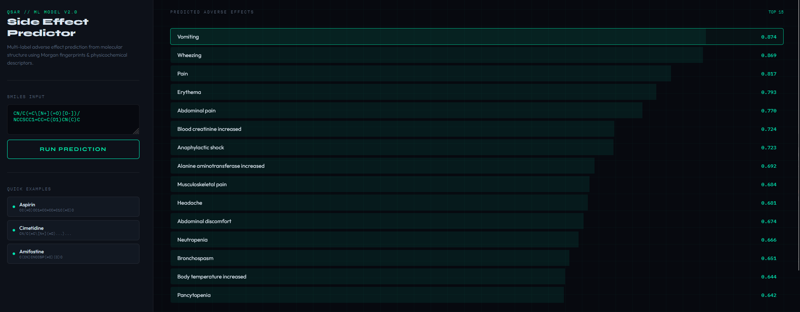

# QSAR Side Effect Predictor

A machine learning web application that predicts adverse drug side effects from molecular structure using hybrid features (Morgan fingerprints + physicochemical descriptors) and provides SHAP-based atom contribution visualizations.

## Features

* **Multi-label Classification** – Predicts top-15 adverse effects from a SMILES string
* **Hybrid Molecular Features** – Combines multi-radius Morgan fingerprints (r=2,3,4,5 @ 1024 bits each) with 14 RDKit physicochemical descriptors
* **SHAP Interpretability** – Visualizes which atoms contribute most to each predicted effect using similarity maps
* **Web Interface** – Clean, responsive UI with example molecules and real-time predictions
* **REST API** – JSON endpoints for programmatic access

## Demo



## Tech Stack

* **Backend**: Flask (Python)
* **ML Libraries**: scikit-learn, XGBoost/RandomForest, SHAP
* **Cheminformatics**: RDKit
* **Frontend**: HTML5, CSS3, JavaScript (vanilla)

## Project Structure

```
.
├── app.py              # Flask web application
├── index.html          # Frontend UI
├── hybrid_model.pkl    # Trained model (multi-label classifiers + metadata)
├── predictor.py        # Standalone prediction module
├── predict_hybrid.py   # CLI prediction script
└── styles.css          # Legacy styling (optional)
```

## Installation

### Prerequisites

* Python 3.8+
* RDKit (install via conda recommended)

### Setup

```bash
# Clone the repository
git clone https://github.com/yourusername/qsar-side-effect-predictor.git
cd qsar-side-effect-predictor

# Create virtual environment
python -m venv venv
source venv/bin/activate  # Linux/Mac
# or venv\Scripts\activate  # Windows

# Install dependencies
pip install flask numpy scikit-learn joblib shap rdkit-pypi matplotlib

# Or using conda (recommended for RDKit)
conda create -n qsar_env python=3.9 rdkit flask numpy scikit-learn joblib shap matplotlib
conda activate qsar_env
```

## Usage

### Run Web Application

```bash
python app.py
```

Then open http://localhost:5000 in your browser.

## API Endpoints

### POST /predict

Predict top-15 side effects for a SMILES string.

**Request:**

```json
{
  "smiles": "CC(=O)OC1=CC=CC=C1C(=O)O"
}
```

**Response:**

```json
{
  "results": [
    {"effect": "Nausea", "score": 0.892},
    {"effect": "Headache", "score": 0.765}
  ]
}
```

### POST /shap

Generate SHAP atom contribution map for a specific effect.

**Request:**

```json
{
  "smiles": "CC(=O)OC1=CC=CC=C1C(=O)O",
  "effect": "Nausea"
}
```

**Response:**

```json
{
  "image": "base64_encoded_png",
  "effect": "Nausea"
}
```

## Command Line Prediction

```bash
python predict_hybrid.py "CC(=O)OC1=CC=CC=C1C(=O)O"
```

## Model Architecture

* **Input Features**: 4096 Morgan fingerprint bits (4 radii × 1024 bits) + 14 scaled descriptors = 4110 dimensions
* **Training Data**: SIDER database + ChEMBL targets
* **Label Set**: Adverse effects with ≥50 occurrences in training (multi-label binarization)
* **Classifiers**: One binary classifier per effect (RandomForest/XGBoost)
* **Loss**: Weighted binary cross-entropy for class imbalance

## Example Molecules

| Drug       | SMILES                                      |
| ---------- | ------------------------------------------- |
| Aspirin    | CC(=O)OC1=CC=CC=C1C(=O)O                    |
| Cimetidine | CN/C(=C[N+](=O)[O-])/NCCSCC1=CC=C(O1)CN(C)C |
| Amifostine | C(CN)CNCCSP(=O)(O)O                         |

## SHAP Interpretation

The color map in the visualization shows:

* **Blue/Purple** – Atomic environments that increase probability of the effect
* **Red/Orange** – Atomic environments that decrease probability

The mapping algorithm distributes fingerprint bit contributions evenly across all atoms in each Morgan environment (radius-dependent weighting).

## Performance Notes

* First prediction may be slower due to SHAP explainer initialization
* SHAP computation scales with molecule size (typically 1–3 seconds)
* Model file (`hybrid_model.pkl`) not included – requires training pipeline

## Training Your Own Model

To reproduce or retrain the model:

* Prepare multi-label dataset (SMILES → list of side effects)
* Extract hybrid features as defined in `predictor.py`
* Train one binary classifier per label (scikit-learn)
* Save as `hybrid_model.pkl` with keys: `models`, `mlb`, `scaler`, `fp_size`, `target_mlb`, `top_k`

## Contributing

Contributions welcome! Please open an issue or PR for:

* Additional feature extraction methods
* Support for more model backends (PyTorch, TensorFlow)
* Performance optimizations
* Unit tests

## License

MIT

## Citation

If you use this tool in research, please cite:

```
[Your preprint/paper information]
```

## Acknowledgments

* RDKit – Cheminformatics toolkit
* SHAP – Model interpretability
* SIDER – Side effect resource
* ChEMBL – Bioactive molecule database

## Contact
